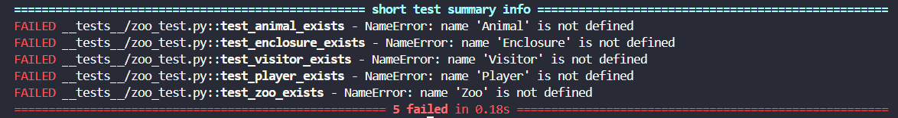
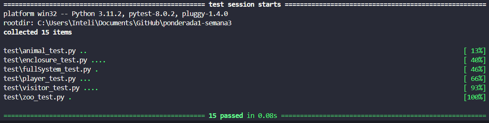

## API para Jogo de Zoológico

### 📖 Descrição
Essa atividade contempla o desenvolvimento de uma API para um jogo de zoológico. Essa API foi planejada pensando em oferecer funcionalidades completas e concisas para o jogo. O desenvolvimento foi realizado em python, seguindo a metodologia orientada a testes TDD.

### 🔹Requisitos 
- Criação de Animais, tendo o mesmo nome, espécie e nível de felicidade.
- Criação de Recintos para abrigar os animais, contendo um ou mais animais da mesma espécie, sendo estes bem ou mal cuidados. Pense em funções para alterar os recintos. 
- Alimentar os Animais, sendo que isso irá tornar os animais mais ou menos felizes. 
- Receber visitantes: Esta função irá permitir que os jogadores ganhem dinheiro com base no número de visitantes que o zoológico atrai. Visitantes são atraídos por animais felizes e recintos bem cuidados. 

### 🔹Procedimento de Desenvolvimento
**Etapa 1: Escrever testes que devem falhar** 
Através dos requisitos, foram desenvolvidos testes iniciais para verificar a existência das classes. Como não haviam classes, o teste deveria falhar. [Commit 1](https://github.com/Paula-zp/ponderada1-semana3/commit/26c17fb51036de2e1c469e5d5885f0a3becec26f)

 Figura 2 - Procedimento de teste das classes 

 Fonte: Material produzido pela autora (2024) 

**Etapa 2: Escrever o código do teste e refatorar** 
O segundo passo foi escrever o mínimo de código necessário para fazer os testes passarem, ou seja, criar as classes. Após, foi feita uma refatoração para que o código ficasse o melhor possível. 

O código dessa etapa pode ser explorado acessando o repositório no ponto do [commit 2](https://github.com/Paula-zp/ponderada1-semana3/commit/8f2be980780dbf32b545efffb732f2a282bc9094) e utilizando o comando `pytest test` no console.

**Etapa 3: Escrever testes de funcionalidades** 
O terceiro passo foi criar os testes das funcionalidades, em cada uma das classes, que iriam abranger os requisitos solicitados. Novamente, esses testes deveriam falhar, uma vez que as funcionalidades não estavam implementadas.

O código dessa etapa pode ser explorado acessando o repositório no ponto do [commit 3](https://github.com/Paula-zp/ponderada1-semana3/commit/62e60ac37e9d9055f8831b0a83887279af365896) e utilizando o comando `pytest test` no console.

**Etapa 4: Escrever o código das funcionalidades e refatorar** 
O quarto passo foi desenvolver o código para passar nos testes realizados anteriormente. Assim que os testes começaram a dar positivo, o código precisou ser refatorado para ficar sem duplicações e conciso. Essa foi a etapa onde todos os requisitos elencados foram atendidos, dando a API uma maneira de fornecer a criação de animais, visitantes, e toda a mecânica do jogo.

O código dessa etapa pode ser explorado acessando o repositório no ponto do [commit 4](https://github.com/Paula-zp/ponderada1-semana3/commit/59cd927950fad3f33ef56d4383d095b5f595ae50) e utilizando o comando `pytest test` no console.

 Figura 2 - Procedimento de teste das funcionalidades 

 Fonte: Material produzido pela autora (2024) 

**Etapa 5: Teste de sistema final** 
O último passo foi ver se a integração de todas as classes da API estava fucionando, realizando um teste geral do sistema. Esse teste buscou realizar todas as funcionalidades descritas nos requisitos e implementadas, criando animais, adicionando eles nos recintos, adicionando visitantes, recebendo dinheiro dos visitantes, trocando o status dos recintos e comparando o número de visitantes quando o zoológico não está tão bem cuidado.

O código dessa etapa pode ser explorado acessando o repositório no ponto do [commit 5](https://github.com/Paula-zp/ponderada1-semana3/commit/2350a1e0eee09871183a41f22be6d5d4857dcfe0) e utilizando o comando `pytest -s` no console para ver os testes e comparações descritas acima.

### 📁 Estrutura de pastas

Dentre os arquivos presentes na raiz do projeto, definem-se:

- <b>readme.md</b>: explicação geral sobre o projeto (o mesmo que você está lendo agora).

- <b>src</b>: aqui estarão todos os arquivos do projeto.

- <b>test</b>: aqui estarão todos os arquivos de testes do projeto.

- <b>imagens</b>: aqui estarão todas as imagens utilizadas nessa socumentação.